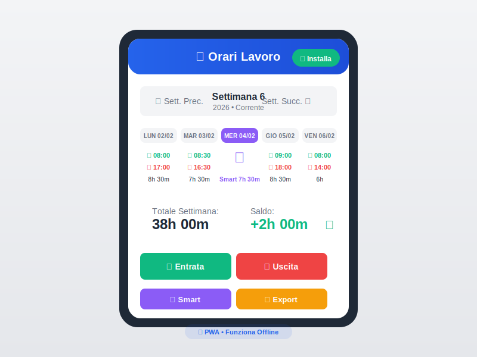

# ⏰ Orari Lavoro PA

[](https://opensource.org/licenses/MIT)
[](https://web.dev/progressive-web-apps/)
[](#)
[](#)
[](#)

> 📱 **L'app gratuita per tracciare le ore di lavoro dei dipendenti pubblici italiani.**  
> Funziona offline, si installa come un'app nativa, i tuoi dati restano solo sul tuo dispositivo.



---

## 🎯 Perché Orari Lavoro PA?

| ❌ Altre App | ✅ Orari Lavoro PA |
|-------------|-------------------|
| Richiedono account | **Nessuna registrazione** |
| Dati su server esterni | **Dati solo sul TUO dispositivo** |
| Abbonamento mensile | **100% Gratuita, per sempre** |
| Servono per tutti | **Pensata per la PA italiana** |
| Calcoli manuali | **36h/settimana automatiche** |

---

## ✨ Funzionalità

### 📊 Calcolo Automatico Ore
- **Target settimanale 36 ore** - standard PA italiana
- **Saldo positivo/negativo** in tempo reale
- **Pausa automatica 30 minuti** (Lun-Gio, escluso Venerdì)
- **Settimane ISO 8601** - navigazione facile

### 🏠 Smart Working & Assenze
- **Lavoro Agile**: 7h30 (Lun-Gio) / 6h (Venerdì)
- **Assenze**: traccia ferie, permessi, malattia
- **Entrate/Uscite multiple** per lo stesso giorno

### 🔒 Privacy & Sicurezza
- **Zero cloud**: i dati non lasciano MAI il tuo dispositivo
- **Nessun tracciamento**: no analytics, no cookies di terze parti
- **Open source**: codice verificabile da chiunque

### 📴 Funziona Offline
- **Installa come app nativa** su smartphone e desktop
- **Funziona senza internet** - perfetto in ufficio senza WiFi
- **Si aggiorna automaticamente** quando torni online
- **Aggiornamenti PWA**: se compare il banner, tocca "Aggiorna ora" per applicare la nuova versione

### 📤 Export Dati
- **JSON**: backup completo importabile
- **CSV/Excel**: per elaborazioni e report
- **Backup automatico** ogni 24h su storage locale

---

## 🔐 I Tuoi Dati Sono Tuoi

```
┌─────────────────────────────────────────────────────┐
│              📱 IL TUO DISPOSITIVO                  │
│                                                     │
│   ┌───────────────┐    ┌──────────────────────┐   │
│   │ localStorage  │    │     IndexedDB        │   │
│   │  (Primario)   │    │     (Backup)         │   │
│   └───────────────┘    └──────────────────────┘   │
│                                                     │
│   ✅ Dati salvati SOLO qui                         │
│   ✅ Nessun server esterno                         │
│   ✅ Nessun account richiesto                      │
│   ✅ Export manuale quando vuoi                    │
│                                                     │
└─────────────────────────────────────────────────────┘
                         │
                         ✕ NESSUN DATO ESCE
```

### Come Funziona lo Storage

| Storage | Cosa Contiene | Limite | Persistenza |
|---------|--------------|--------|-------------|
| **localStorage** | Dati settimanali, config | ~5 MB | Permanente |
| **IndexedDB** | Backup automatici | ~50+ MB | Permanente |
| **Export JSON** | File scaricabile | Illimitato | Tuo controllo |

> ⚠️ **Nota iOS**: Safari può eliminare i dati PWA dopo 7 giorni di inutilizzo.  
> **Soluzione**: Apri l'app almeno 1 volta a settimana o esporta periodicamente i dati.

---

## 🚀 Inizia Subito

### Usa Online (Nessuna Installazione)
👉 **[Apri Orari Lavoro PA](https://vtvito.github.io/italian-pa-employee-attendance/)**

### Installa come App

#### 📱 Android (Chrome)
1. Apri il link sopra in Chrome
2. Tocca **"Installa"** nel banner che appare
3. Oppure: Menu (⋮) → "Aggiungi a schermata Home"

#### 🍎 iOS (Safari)
1. Apri il link **in Safari** (non Chrome!)
2. Tocca l'icona condivisione ⬆️
3. Seleziona **"Aggiungi a Home"**

#### 💻 Desktop (Chrome/Edge)
1. Apri il link nel browser
2. Clicca l'icona **⊕** nella barra indirizzi
3. Conferma "Installa"

---

## 🏗️ Per Sviluppatori

### Architettura

L'app segue un pattern **MVC + Observer + Repository**:

```
js/
├── controllers/     # Logica applicativa (AppController)
├── models/          # Strutture dati (TimeEntry, WeekData)
├── views/           # UI rendering (UIManager, ModalManager)
├── services/        # Business logic (TimeCalculator, ExportService)
├── storage/         # Persistenza (StorageManager, adapters)
└── utils/           # Utilities (EventBus, DateUtils, Validators)
```

### Stack Tecnologico

- **Frontend**: HTML5, CSS3, Vanilla JavaScript ES6+
- **Architettura**: MVC + Observer (EventBus) + Repository Pattern
- **Storage**: localStorage + IndexedDB (dual storage con fallback)
- **PWA**: Service Worker, Web App Manifest
- **Build**: Zero dependencies, no bundler required

### Sviluppo Locale

```bash
git clone https://github.com/VTvito/italian-pa-employee-attendance.git
cd italian-pa-employee-attendance

# Avvia server locale
python -m http.server 8000
# oppure: npx serve .
# oppure: php -S localhost:8000

# Apri http://localhost:8000
```

### Test Suite

```bash
# Apri nel browser
http://localhost:8000/tests/

# Oppure da console (F12)
AllTests.runAll()
```

---

## 📋 Configurazione

Le costanti sono in [js/services/TimeCalculator.js](js/services/TimeCalculator.js):

```javascript
export const CONFIG = {
    WEEKLY_TARGET_HOURS: 36,      // Ore settimanali target PA
    PAUSE_MINUTES: 30,            // Pausa automatica
    SMART_HOURS_DEFAULT: 7.5,     // Smart working Lun-Gio
    SMART_HOURS_FRIDAY: 6,        // Smart working Venerdì
    MIN_HOURS_FOR_PAUSE: 6        // Soglia minima per pausa
};
```

---

## 🌐 Self-Hosting

### GitHub Pages (Gratuito)
Già configurato! Basta abilitare Pages nelle impostazioni del repo.

### Netlify / Vercel / Cloudflare Pages
Collega il repo e deploya automaticamente.

### Docker
```dockerfile
FROM nginx:alpine
COPY . /usr/share/nginx/html
EXPOSE 80
```

---

## 🔮 Roadmap & Feature Future

### In Valutazione
- **🚀 Shortcut Rapide da Homescreen**: Due icone separate per "Entrata" e "Uscita" che permettano di timbrare senza aprire l'app
- **📊 Statistiche Mensili**: Visualizzazione grafica del monte ore mensile
- **🔔 Notifiche Push**: Promemoria per timbratura mancante
- **☁️ Sync Cloud Opzionale**: Sincronizzazione volontaria tra dispositivi

Vuoi una feature? [Apri una Issue](https://github.com/VTvito/italian-pa-employee-attendance/issues)!

---

## 🤝 Contribuisci

Le Pull Request sono benvenute! Per modifiche importanti, apri prima una Issue.

1. Fork del repository
2. Crea un branch (`git checkout -b feature/nuova-funzione`)
3. Commit (`git commit -am 'Aggiunge nuova funzione'`)
4. Push (`git push origin feature/nuova-funzione`)
5. Apri una Pull Request

---

## 📄 Licenza

Distribuito sotto licenza **MIT** - vedi [LICENSE](LICENSE).

---

## 👤 Autore

**VTvito** - [@VTvito](https://github.com/VTvito)

---

## 🏷️ Tag & Keywords

`timbrature` `orario-lavoro` `pubblica-amministrazione` `pa-italiana` `dipendenti-pubblici` `smart-working` `lavoro-agile` `gestione-ore` `timesheet` `presenze` `pwa` `offline-first` `privacy-first` `open-source` `gratuito` `no-backend` `flessibilità-oraria` `36-ore` `settimana-lavorativa`

---

<p align="center">
  <strong>⭐ Se ti è utile, lascia una stella! ⭐</strong>
</p>
